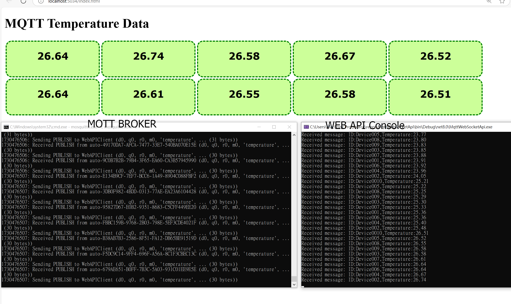

# 專案說明

 - 用.NET WebApi 開發的MQTT Client。
 - 安裝  MTQQ Server 後，Run Python 模擬的 MQTT Client。以 a.bat 啟動十支，ID 編號從 Device001~Device0010。資料內容為模擬溫度，溫度以SIN波形變化，每支程式每秒各送一次。(Python 程式在py資料夾中)
 - WebApi啟動訂閱後，可讓網頁透過 WebSocket 方法取得數據後，各自顯示在各區塊。

  

